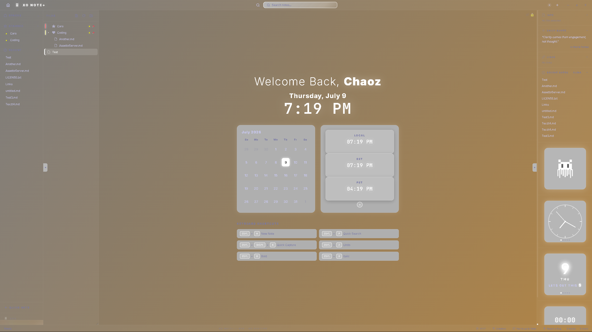
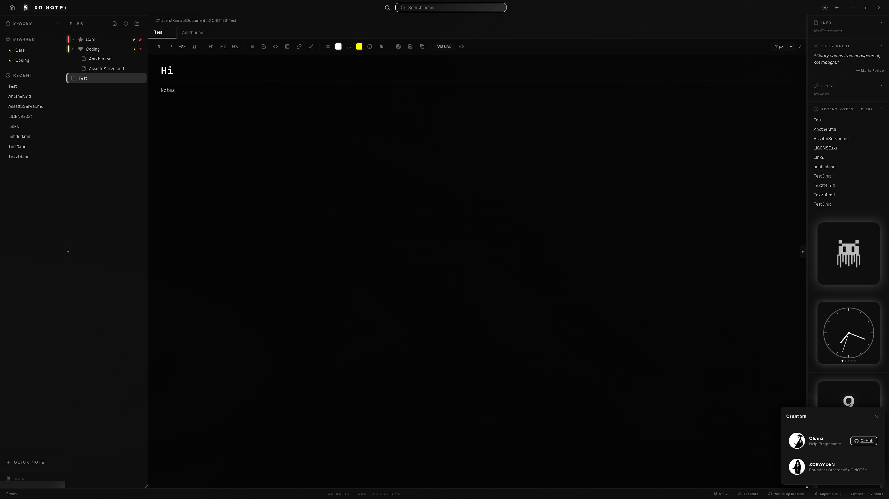
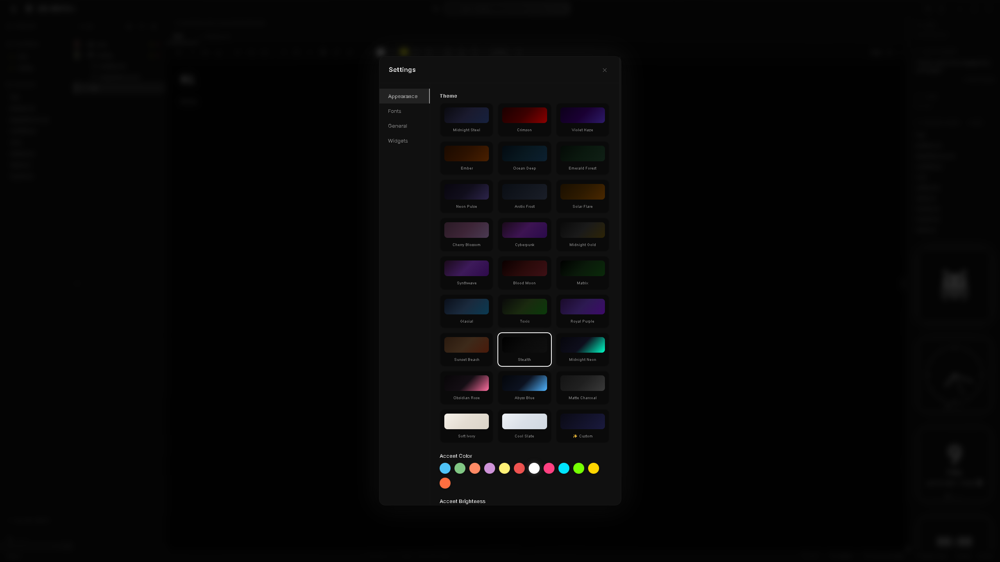

[README.md](https://github.com/user-attachments/files/29868936/README.md)
# XO NOTE+

A premium local markdown workspace by **XO Systems** — fast, private, and fully under your control. Everything lives in a vault on your own machine: no cloud, no accounts, no syncing your notes to someone else's server.

## About

XO NOTE+ is a desktop note-taking app built around a simple idea: writing software should feel calm and get out of your way, while still giving you real control over how it looks and behaves. It pairs a clean markdown editor with a genuinely customizable interface — dozens of built-in themes, a full custom theme builder, a home dashboard with widgets, and fine-grained control over colors and accents — all running locally against a folder of plain markdown files you own.

## Features

- **Local-first vault** — your notes are plain `.md`/`.txt` files in a folder you choose. No account, no cloud sync, nothing leaves your machine.
- **Markdown editor** — rich formatting toolbar, headings, tables, code blocks, checklists, and both rich and preview editing modes.
- **File management** — a sidebar file tree with drag-and-drop import, tabs for multiple open notes, full-text search, starred and recent notes, and Save / Save As / Save a Copy (including PDF export).
- **Home dashboard** — a landing screen with a calendar, multi-timezone clocks, sticky notes, sticky tasks, a daily motivational quote, and an instant one-click "Quick Note."
- **10 dashboard themes** — Classic, Midnight Command, Focus Flow, Mission Control, Horizon, plus five "+" abstract themes (Aurora+, Neon District+, Zen Garden+, Retro Terminal+, Glass Morphic+).
- **24+ color themes**, including a full **Custom Theme Builder** (solid or gradient backgrounds, direction/spread controls, custom accent color) that you can export to a file and import again on another install.
- **Deep accent controls** — accent color presets, brightness, a separate outline color, and an optional two-color gradient, with a live preview box so you can see changes instantly.
- **Flexible backgrounds** — animated gradient, solid color, or a custom image with adjustable blur, plus an independent "Glass Mode" for see-through panels over any of them.
- **Built-in auto-updates** — checks GitHub Releases automatically (with an on/off toggle in Settings), and lets you choose between updating to the latest version or picking any specific version, including downgrades.
- **Creators panel & bug reporting** — see who built the app and file a bug report straight to GitHub Issues from the bottom bar.

## Screenshots

| | |
|---|---|
| 
d-dark.png) |  |
|  |  |

## Creators

Built by **XO Systems**:

- **Chaoz** — Help Programmer
- **XORAYDEN** — Founder / Creator of XO NOTE+

## License

XO NOTE+ is proprietary software — **All Rights Reserved**. See [LICENSE](LICENSE) for the full terms. In short: you're welcome to download and use the app, but the source code, assets, and branding may not be copied, modified, redistributed, or used commercially without permission from XO Systems.
